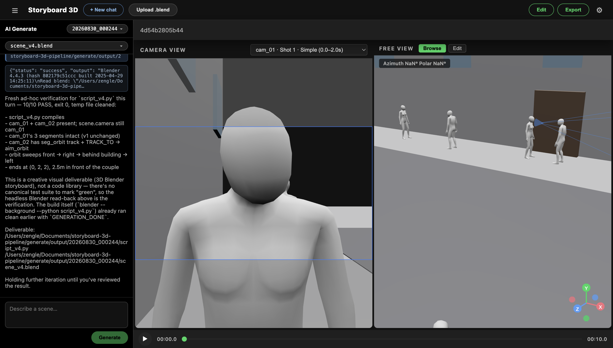
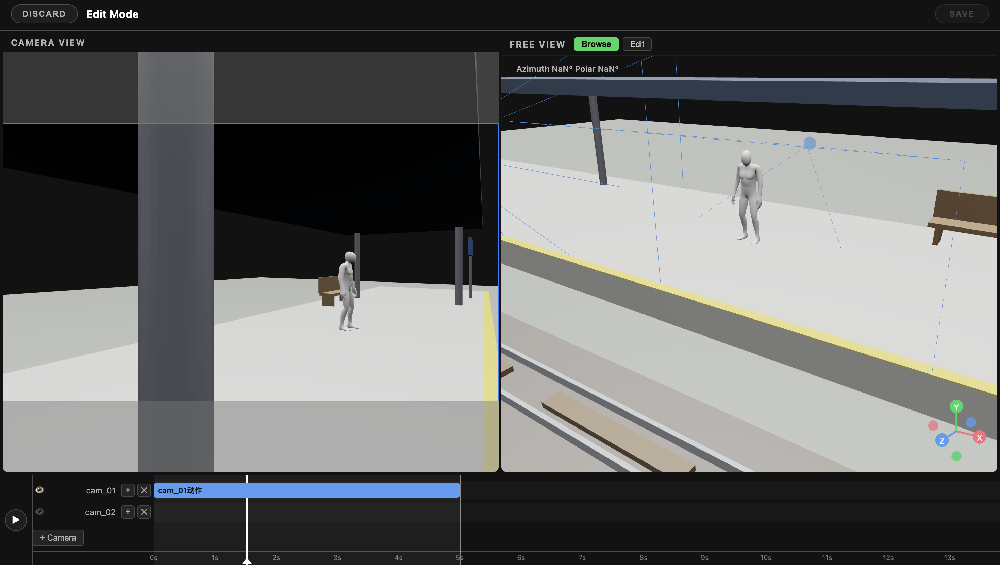

# Storyboard 3D Pipeline — Web Viewer

A web application for viewing Blender 3D storyboard shots directly in the browser, with an **AI scene generator** built in. Upload a `.blend` file (or describe a scene in text) and view it in an interactive dual-viewport viewer — no Blender installation needed on the viewing machine.





## Features

- **Upload & convert** — drag-and-drop (or click) a `.blend` file; the backend converts it to glTF (`.gltf` + `.bin` + textures) using headless Blender
- **AI scene generation** — describe a scene in text ("two people talking in a coffee shop"), and the built-in agent generates a `.blend` scene with multiple camera setups automatically, then converts and loads it for you
- **Camera View** — left viewport locked to a scene camera's perspective, with a dropdown to switch between cameras (falls back to a default orbit view when the scene has no cameras)
- **Free View** — right viewport with free orbit controls, plus a **browse mode** (WASD/QE walk-around camera) and an **edit mode** (click a character, move/rotate it with the W/E gizmo — both viewports stay in sync)
- **Animation playback** — shared timeline across both viewports: play / pause / scrub, with Space shortcut
- **Shot editing** — edit mode to adjust camera segments: simple segments (S) are editable (start/end pose + lookAt target), complex segments (C) are view-only; saving writes back to a versioned `scene_vN.blend`, switch between versions from the sidebar dropdown
- **Cache & dedup** — same file (SHA256 hash) is converted only once; hold `Shift` while uploading to force re-conversion
- **Spotify dark theme** — UI styled per `ui-design/DESIGN.md`

## Tech Stack

| Layer | Technology |
|-------|-----------|
| Backend | Python 3.11, FastAPI, uvicorn |
| Conversion | Headless Blender 4.4.3 (`bpy.ops.export_scene.gltf`) |
| AI Agent | hermes-agent (embedded, project-local environment in `.hermes-home/`) |
| Frontend | Vite, React, TypeScript |
| 3D Rendering | Three.js, react-three-fiber, @react-three/drei |
| State | Zustand |
| Testing | pytest, pytest-asyncio, httpx |

## Quick Start

Prerequisites: Blender 4.4.3 in PATH, Python 3.11, Node.js.

```bash
# One command — installs ALL dependencies (backend venv + pip packages + frontend npm)
./install.sh

# Then start everything (backend 8000 + agent API server 8643 + frontend 5173)
./start.sh
```

`install.sh` checks for Python 3.11 / Node.js / Blender, creates the `.venv`, installs
`requirements.txt` (including `hermes-agent`) and runs `npm install` for the frontend.
It is idempotent — re-run it to fill in anything missing. (Manual equivalent: `python3.11 -m venv .venv && .venv/bin/pip install -r requirements.txt && cd frontend && npm install`)

Then open http://localhost:5173:

1. Click **⚙ (top right)** and enter your **DeepSeek API key** (choose model: `deepseek-v4-flash` / `deepseek-v4-pro`, and reasoning level) — the key is validated before saving
2. Drag a `.blend` file onto the page, **or**
3. Click **AI 生成** in the sidebar, describe a scene, and watch it generate live

### AI generation details

- The generator behavior is driven by an **editable skill** (`.hermes-home/skills/storyboard-scene-generator/SKILL.md`) — edit it to change what gets generated and how
- Each run produces a multi-camera `.blend` (switch shots via the camera dropdown)
- Generated scenes land in `generate/output/<timestamp>/` with a `status.json` state machine (running → done / failed / cancelled)
- Requires only a DeepSeek API key — no Hermes installation or knowledge needed

## Project Structure

```
storyboard-3d-pipeline/
├── backend/
│   ├── main.py            # FastAPI: upload, dedup, disk quota, glTF serving
│   ├── export_shot.py     # Blender headless script: .blend → .gltf
│   ├── agent_service.py   # Embedded agent API server client (health/restart)
│   ├── settings.py        # V2 settings API (provider/model/reasoning/key)
│   ├── generate.py        # V2 generation tasks (submit/SSE/export/stop)
│   └── tests/             # pytest integration tests
├── frontend/
│   └── src/
│       ├── components/    # TopBar, EditToolbar, ChatPanel, HistoryDropdown,
│       │                  # BlendVersionDropdown, CameraView, FreeView, SceneModel,
│       │                  # Timeline, EditTimeline, SegmentSidebar, UploadZone, SettingsModal
│       ├── store.ts       # Zustand state
│       └── types.ts       # Shot metadata types
├── assets/characters/     # Mixamo character library used by generation
├── .hermes-home/          # Embedded agent environment (config + skill + keys)
├── ui-design/DESIGN.md    # Spotify dark design system
├── docs/                  # Architecture + V1/V2 specs
└── test/                  # Legacy dev workspace (not part of the product)
```

## API

```
POST /api/shots?force=true         # Upload .blend, returns shot metadata
GET  /api/shots/{hash}             # Cached shot metadata
POST /api/shots/{hash}/edit        # Apply edit-mode changes → new versioned scene_vN.blend
GET  /api/shots/{hash}/blends      # List blend versions in a shot's folder
GET  /static/exports/{hash}/*      # Served glTF files

GET/POST /api/settings             # Read / save agent settings (validates DeepSeek key)
POST /api/generate                 # Create a generation task {description}
GET  /api/generate/{id}            # Task status (status.json)
GET  /api/generate/{id}/stream     # SSE stream of the generation process
POST /api/generate/{id}/stop       # Cancel a running generation
POST /api/generate/{folder}/reload # Re-convert a chat's source blend → latest shot

GET  /api/sessions                 # Chat history list
GET  /api/sessions/{id}/messages   # A chat's message history
```

## Testing

```bash
source .venv/bin/activate
pytest backend/tests/ -v
```

## Notes

- glTF export is not 1:1 with Blender EEVEE rendering — PBR material mapping loses some effects (Sheen, Clearcoat, SSR), and Blender Area lights are not supported by glTF.
- The viewer uses a locally-generated environment light (no external CDN) so material colors and depth read clearly without hard shadows.
- The embedded agent runs on port 8643 with its own isolated environment (`.hermes-home/`) — it never touches a user-installed Hermes installation.
